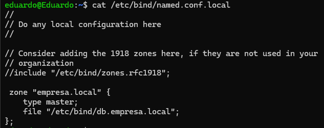
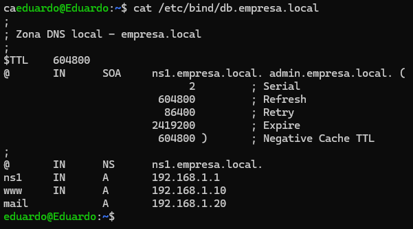
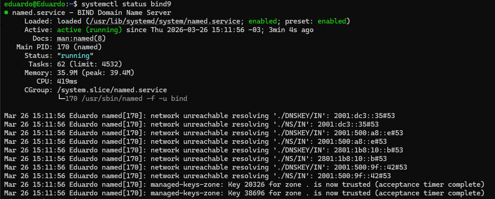
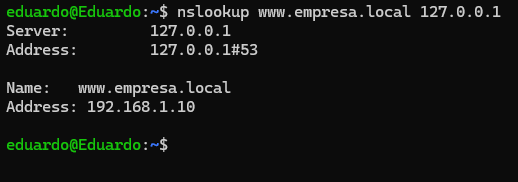

# Lab 4 — Local DNS Server (BIND9) 📡

## 🎯 Objective
Configure an authoritative local DNS server on Linux (Ubuntu/WSL) to understand name resolution, zone management, and Resource Records (RR). This lab simulates a real enterprise infrastructure environment.

---

## 💻 Technical Environment
* **OS:** Ubuntu 22.04 LTS (WSL2)
* **Service:** BIND9 (Berkeley Internet Name Domain)
* **Testing Tool:** `nslookup`

---

## 🛠️ Execution Steps

### 1. Installation and Zone Configuration
I installed the service and configured the `named.conf.local` file to define the `empresa.local` zone. This file tells BIND where to find the domain data.

```bash
sudo apt update && sudo apt install bind9 -y
sudo nano /etc/bind/named.conf.local
```



2. Creating the Zone Database (A Records)
I created the zone file based on the db.local template. I added Type A (Address) records, which map hostnames to their respective IP addresses.

```
sudo cp /etc/bind/db.local /etc/bind/db.empresa.local
sudo nano /etc/bind/db.empresa.local
```

Configured Records:

ns1 -> Name Server

www -> Enterprise Web Server

mail -> Enterprise Mail Server




3. Syntax Validation and Service Restart
Before deploying, I used validation tools to ensure there were no syntax errors.

sudo named-checkconf
sudo named-checkzone empresa.local /etc/bind/db.empresa.local
sudo systemctl restart bind9




🔍 Troubleshooting and Results (NOC View)
As a Junior Network Analyst, I performed resolution tests to ensure the server provides the correct IP mapping.

Local Resolution Test
The following command validates if the server correctly resolves the configured hostname.

```
nslookup www.empresa.local 127.0.0.1
```



Key Takeaways
A Record: Essential for mapping names to IPv4. Without it, web navigation by hostname is impossible.

SOA (Start of Authority): Defines global parameters for the zone.

NOC Importance: Issues like "slow internet" or "site down" are often just DNS resolution failures.

Project developed by Eduardo Mello de Almeida
Network Engineering Student | Rumo au CCNA 2026
